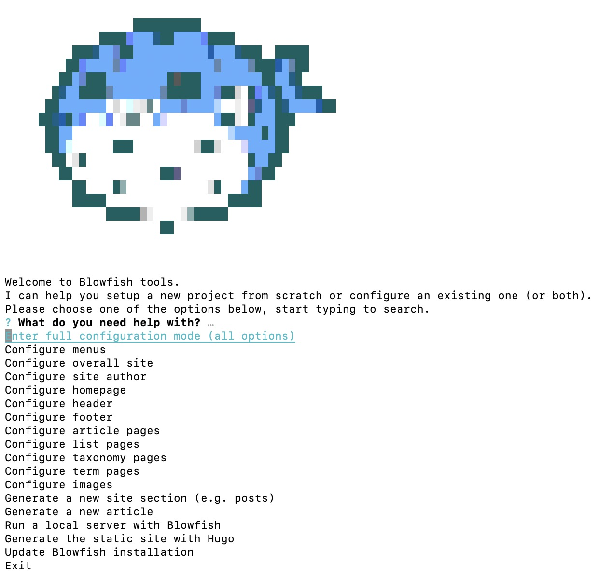
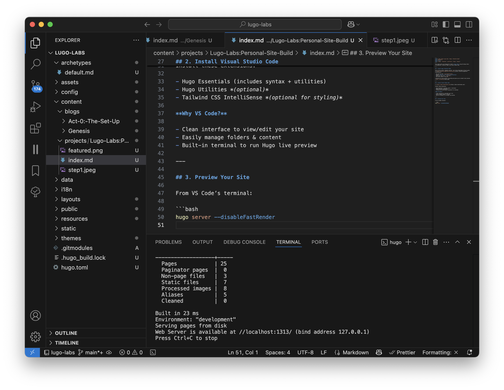

This guide walks you through how I built **Lugo Labs** using the Hugo static site generator, Blowfish theme, and Visual Studio Code.

---

## 1. Install Hugo & Blowfish Theme

Skip writing install commands yourself. Just follow Blowfish’s official guide:  
👉 [https://blowfish.page/docs/installation/](https://blowfish.page/docs/installation/)

- Use the CLI tool: `npx blowfish-tools`
- Choose: **Set up a new website with Blowfish**
- Name your site (e.g., `lugo-labs`)
- Use local folder or new one

✅ Blowfish CLI auto-installs everything and gives you an instant local preview.


---

## 2. Install Visual Studio Code

👉 [https://code.visualstudio.com/](https://code.visualstudio.com/)

Install these extensions:

- Hugo Essentials (includes syntax + utilities)
- Hugo Utilities *(optional)*
- Tailwind CSS IntelliSense *(optional for styling)*

**Why VS Code?**

- Clean interface to view/edit your site
- Easily manage folders & content
- Built-in terminal to run Hugo live preview

---

## 3. Preview Your Site

From VS Code’s terminal:

```bash
hugo server --disableFastRender
```


<!-- markdownlint-disable MD033 -->
<div style="margin-top: -60px; font-size: 1rem; text-align: center;">
  <em>As seen in the example above.</em>
</div>
